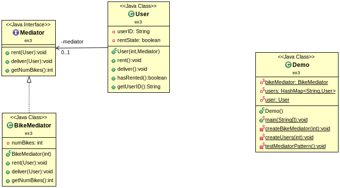

# Lab 10, ex3

## 1. Problema

Pretende-se que, num sistema de aluguer de bicicletas, permitir aos utilizadores alugar e entregar a bicicleta que alugaram. Um utilizador não pode alugar mais que uma bicicleta. Sempre que um user aluga ou entrega uma bicicleta, os users são informados desses eventos, através de uma aplicação. Essa aplicação também consegue informar o número de bicicletas que não foram alugadas, a qualquer momento.

## 2. Solução



Como solução foi usado o padrão Mediator. Os utilizadores assumem o papel de consumidores, quando alugam a bicicleta, e também de produtores, quando entregam a bicicleta. A classe BikeMediator pode ser vista como uma aplicação que gere o sistema de aluguer, sendo caracterizada pelo número de bicicletas não alugadas.

A classe User caracteriza-se pelo `rentState`, para saber se a bicicleta foi ou não alugada (cada user não pode alugar mais que uma bicicleta), para além do `mediator` e `userID`. O atributo `mediator` é usado para chamar os métodos da aplicação. Em vez de comunicar diretamente a cada user sobre um user que alugou ou entregou uma bicicleta, essas informações são apenas comunicadas à aplicação, à qual todos os users têm acesso. Este mecanismo é o que define o padrão Mediator, conforme mostrado no excerto de código abaixo:

```java

    // classe User.java

    public void rent() {
        mediator.rent(this); // Padrão Mediator: chama método de BikeMediator com a implementação de código necessária
        rentState = true;
    }

    public void deliver() {
        mediator.deliver(this); // Padrão Mediator: chama método de BikeMediator com a implementação de código necessária
        rentState = false;
    }

```

## 3. Referências

- https://www.newthinktank.com/2012/10/mediator-design-pattern-tutorial/
